<p align="center">
  <picture>
    <source media="(prefers-color-scheme: dark)" srcset="assets/qwenclaw_logo_badge.svg">
    <source media="(prefers-color-scheme: light)" srcset="assets/qwenclaw_logo_badge.svg">
    
  </picture>
</p>

<p align="center">
  <strong>C++23 modules-first agent gateway with local inference, tool orchestration, and plugin sidecar runtime.</strong>
</p>

<p align="center">
  <picture>
    <source media="(prefers-color-scheme: dark)" srcset="assets/badge-inline.svg">
    <source media="(prefers-color-scheme: light)" srcset="assets/badge-inline.svg">
    
  </picture>
  &nbsp;
  <a href="LICENSE"></a>
  
  
  
</p>

---

## Overview

QwenClaw is a fork of the OpenClaw/QuantClaw lineage — a WebSocket RPC gateway + agentic runtime built entirely on C++23 modules. It drives a multi-turn reasoning loop with tool use, streams responses over JSON-RPC 2.0, and supports both Anthropic Claude and local llama.cpp inference out of the box.

### What's in the box

- **WebSocket RPC gateway** on `127.0.0.1:18800` — JSON-RPC 2.0, async request/response, server-push event streaming
- **HTTP control API + Lit dashboard** on `127.0.0.1:18801` — real-time session monitoring and config management
- **Agent loop** — multi-turn reasoning with dynamic iteration limits (32–160), tool calls, fallback chains, and stream-based event emission
- **Provider layer** — Anthropic `/v1/messages` and OpenAI-compatible `/v1/chat/completions` (llama-server) with multi-key rotation, cooldown tracking, and automatic failover
- **Tool system** — filesystem ops, subprocess exec, web search, browser control, DuckDB queries, cron scheduling, memory search, subagent delegation
- **Session persistence** — DuckDB-backed history with multi-stage compaction (soft prune → hard prune → overflow re-compact)
- **Semantic memory** — hybrid keyword + vector embedding search with MMR reranking and temporal decay
- **Security** — RBAC, per-tool allow/deny, Linux seccomp sandboxing, manual exec approval workflows, rate limiting
- **MCP integration** — server mode (expose tools) and client mode (consume external MCP servers)
- **Plugin sidecar** — Node.js/TypeScript runtime over TCP loopback for OpenClaw-compatible plugins with hot-reload
- **Channel adapters** — Discord and Telegram frameworks (extensible)

## Build requirements

| Requirement | Minimum | Recommended |
|---|---|---|
| GCC | 15 | 16 |
| CMake | 3.31 | latest |
| Generator | Ninja | Ninja |
| C++ standard | C++23 | C++23 |
| Platform | Linux | Linux |

Dependencies managed via vcpkg: `spdlog`, `nlohmann-json`, `curl`, `openssl`, `duckdb`, `ixwebsocket`, `cpp-httplib`, `gtest`.

## Quick start

```bash
# Build
cmake --preset gcc16-ninja
cmake --build --preset gcc16-ninja -j$(nproc)

# First-time setup
./build-cmake43/quantclaw onboard

# Run the gateway
./build-cmake43/quantclaw gateway run

# Send a message
./build-cmake43/quantclaw agent "Summarize this project"
```

The build helper script supports sanitizers, coverage, and debug/release toggling:

```bash
./scripts/build.sh --release --tests
./scripts/build.sh --asan          # AddressSanitizer
./scripts/build.sh --coverage      # gcov instrumentation
```

## CLI

```
quantclaw <command> [options]
```

| Command | Purpose |
|---|---|
| `onboard` | Interactive setup wizard, systemd service install |
| `gateway run\|install\|start\|stop\|restart\|status\|call` | Gateway daemon lifecycle |
| `agent [message]` / `agent stop` | Send message or cancel reasoning |
| `sessions list\|history\|delete\|reset` | Session management |
| `config get\|set\|unset\|reload\|validate\|schema` | Runtime configuration |
| `skills list\|install\|uninstall\|status` | Skill management |
| `plugins list\|status\|install\|uninstall` | Plugin lifecycle |
| `cron list\|add\|remove\|update\|run\|runs` | Scheduled tasks |
| `memory status\|search\|clear` | Memory and search |
| `models list\|set` | LLM model management |
| `channels list\|status` | Channel adapter status |
| `health` | Gateway health check |
| `status` | Gateway status shortcut |
| `doctor` | System diagnostics |
| `dashboard` | Launch control UI |
| `logs` | View gateway logs |

## Configuration

Default config: `~/.quantclaw/config.json`

```json
{
  "agent": {
    "model": "local/Qwen3.5-9B.Q5_K_M.gguf",
    "maxIterations": 20,
    "temperature": 0.2,
    "maxTokens": 3072
  },
  "providers": {
    "local": {
      "baseUrl": "http://127.0.0.1:8081",
      "timeout": 300
    }
  },
  "gateway": {
    "port": 18800,
    "controlUi": { "enabled": true, "port": 18801 },
    "auth": { "mode": "token", "token": "CHANGE_ME" }
  }
}
```

Config supports JSON5 comments/trailing commas and `${VAR}` environment variable substitution. See `config.example.json` for the full shape including `security`, `tools`, `mcp`, `channels`, and `plugins` sections.

## Architecture

```
src/
├── core/           Agent loop, context engine, memory, compaction, scheduling
├── gateway/        WebSocket server/client, JSON-RPC 2.0, daemon management
├── web/            HTTP API, control UI routing
├── providers/      Anthropic + llama.cpp providers, failover, cooldown
├── tools/          Tool registry, pipeline execution
├── session/        DuckDB session storage, compaction
├── mcp/            MCP server/client, tool bridge
├── plugins/        Plugin manifest, registry, sidecar orchestration
├── security/       RBAC, sandbox, approval, rate limiting, scope validation
├── channels/       Channel adapters (Discord, Telegram)
├── cli/            CLI command handlers
├── common/         Shared utilities
└── platform/       OS abstraction
sidecar/            Node.js plugin runtime (TypeScript, JITI loader)
ui/                 Lit web dashboard (Vite, TypeScript)
ui/llama.cpp/       Embedded llama.cpp (builds llama-server)
```

## RPC protocol

JSON-RPC 2.0 over WebSocket. Frames carry `type` (`req` | `res` | `event`), a UUID `id`, and `method` / `payload` / `error` fields. Server-push events stream agent output in real time:

- `agent.text_delta` — streamed LLM response chunks
- `agent.thinking_delta` — extended thinking output
- `agent.tool_use` / `agent.tool_result` — tool invocation lifecycle
- `agent.message_end` — reasoning complete

## Tests

```bash
ctest --test-dir build-cmake43 --output-on-failure
```

40+ test suites covering agent loop, gateway/RPC, providers, tools, sessions, memory, MCP, security, CLI, web API, plugins, and end-to-end workflows.

## Upstream acknowledgment

Fork of the [OpenClaw](https://github.com/openclaw/openclaw)/QuantClaw lineage. Maintains practical ecosystem compatibility (plugin manifests, workspace model, SKILL.md loading, RPC workflows, `llm` config mapping) while diverging on C++23 modules, GCC+Ninja build profile, and local-inference-first defaults.

---

<p align="center">
  <picture>
    <source media="(prefers-color-scheme: dark)" srcset="assets/hero.svg">
    <source media="(prefers-color-scheme: light)" srcset="assets/hero.svg">
    
  </picture>
</p>

<p align="center">
  <picture>
    <source media="(prefers-color-scheme: dark)" srcset="assets/banner.svg">
    <source media="(prefers-color-scheme: light)" srcset="assets/banner.svg">
    
  </picture>
</p>

<p align="center">
  <picture>
    <source media="(prefers-color-scheme: dark)" srcset="assets/logo-compact.svg">
    <source media="(prefers-color-scheme: light)" srcset="assets/logo-compact.svg">
    
  </picture>
  &ensp;
  <picture>
    <source media="(prefers-color-scheme: dark)" srcset="assets/icon.svg">
    <source media="(prefers-color-scheme: light)" srcset="assets/icon.svg">
    
  </picture>
</p>

---

## License

Apache 2.0 — see [LICENSE](LICENSE).
