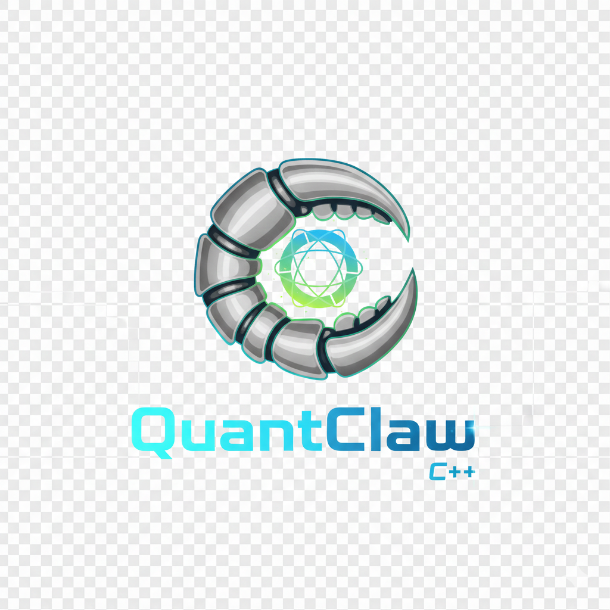

<p align="center">
  
</p>

<h1 align="center">QuantClaw</h1>

<p align="center">
  <strong>High-performance personal AI assistant in C++17</strong>
</p>

<p align="center">
  <a href="README_CN.md">中文文档</a>
</p>

---

QuantClaw is a native C++ implementation of the [OpenClaw](https://github.com/openclaw/openclaw) ecosystem — built for performance and low memory footprint while staying fully compatible with OpenClaw workspace files, skills, and the WebSocket RPC protocol.

## Features

- **Blazing Fast**: C++17 native performance with minimal overhead
- **Memory Efficient**: Small memory footprint, suitable for resource-constrained environments
- **OpenClaw Compatible**: Works with OpenClaw workspace files, skills, and configuration
- **Dual Protocol**: WebSocket RPC gateway + HTTP REST API
- **Multi-Provider LLM**: OpenAI-compatible and Anthropic APIs with `provider/model` prefix routing
- **Channel Adapters**: Connect Discord, Telegram, or custom bots to the gateway
- **Session Persistence**: Full conversation history with tool call context preserved in JSONL
- **Skill System**: Compatible with OpenClaw SKILL.md format
- **MCP Support**: Model Context Protocol for external tool integration
- **File System First**: No database dependencies — everything stored in your workspace

## Quick Start

```bash
git clone https://github.com/QuantClaw/QuantClaw.git
cd QuantClaw
mkdir build && cd build
cmake ..
make -j$(nproc)

# Run tests
./quantclaw_tests

# Install (optional)
sudo make install
```

## Architecture

```
~/.quantclaw/
├── quantclaw.json              # Configuration (OpenClaw format)
└── agents/default/
    ├── workspace/
    │   ├── SOUL.md             # Assistant identity
    │   ├── USER.md             # User information
    │   ├── MEMORY.md           # Long-term memory
    │   ├── memory/             # Daily memory logs
    │   │   └── YYYY-MM-DD.md
    │   └── skills/             # Skills (OpenClaw compatible)
    │       └── weather/
    │           └── SKILL.md
    └── sessions/
        ├── sessions.json       # Session index
        └── <session-id>.jsonl  # Per-session transcript
```

## Configuration

QuantClaw uses JSON configuration. By default the config file is located at `~/.quantclaw/quantclaw.json`. You can specify a custom path with the `--config` / `-c` flag:

```bash
quantclaw --config /path/to/config.json gateway
quantclaw -c /path/to/config.json gateway    # short form
```

Copy the example config to get started:

```bash
mkdir -p ~/.quantclaw
cp config.example.json ~/.quantclaw/quantclaw.json
# Edit the file and fill in your API keys
```

A full example is provided in `config.example.json`. Below is a detailed description of every section.

> **Hot-reload**: The gateway watches the config file for changes and auto-reloads every 5 seconds — no restart needed for most changes. Provider switches (e.g. OpenAI → Anthropic) require a gateway restart.

### `system` — System settings

| Field | Type | Default | Description |
|-------|------|---------|-------------|
| `logLevel` | string | `"info"` | Log verbosity: `trace` > `debug` > `info` > `warn` > `error` |

Set to `debug` when troubleshooting issues, `warn` in production.

```json
{ "system": { "logLevel": "info" } }
```

### `llm` — LLM model settings

This is the most important section — it controls which AI model the agent uses.

| Field | Type | Default | Description |
|-------|------|---------|-------------|
| `model` | string | `"qwen-max"` | Model identifier in `provider/model` format (see below) |
| `maxIterations` | int | `15` | Max tool-call rounds per user message |
| `temperature` | float | `0.7` | Sampling randomness (0 = deterministic, higher = more creative) |
| `maxTokens` | int | `4096` | Max tokens per LLM response (includes text + tool calls) |

**Provider/model routing** — The `model` field uses a `provider/model-name` prefix to select both the LLM provider and the model in a single string:

| `model` value | Provider used | Actual model sent to API |
|---------------|---------------|--------------------------|
| `"openai/gpt-4o"` | openai | `gpt-4o` |
| `"anthropic/claude-sonnet-4-20250514"` | anthropic | `claude-sonnet-4-20250514` |
| `"openai/qwen-max"` | openai | `qwen-max` (via custom baseUrl) |
| `"qwen-max"` | openai (default) | `qwen-max` |

When no prefix is given, the `openai` provider is used. Any API compatible with OpenAI Chat Completion format can be used by setting the provider's `baseUrl` — this includes Qwen (Tongyi), DeepSeek, Moonshot, local Ollama, vLLM, etc.

**`maxIterations`** — Each "iteration" is one LLM call that may trigger tool use (file read, shell exec, etc.). The agent loops: call LLM → execute tools → feed results back → call LLM again, up to this limit. When the limit is reached, the agent stops and returns what it has. Set higher (e.g. 30) for complex multi-step tasks, lower (e.g. 5) to limit cost.

**`temperature`** — Controls randomness. `0.7` is a good balance. Use `0.0`–`0.3` for deterministic/factual tasks, `0.7`–`1.0` for creative tasks. Values above `1.0` are rarely useful.

**`maxTokens`** — The budget for a single LLM reply. If the model hits this limit, the response is cut off. `4096` is fine for most tasks. Increase to `8192`+ only if responses are being truncated.

```json
{
  "llm": {
    "model": "openai/qwen-max",
    "maxIterations": 15,
    "temperature": 0.7,
    "maxTokens": 4096
  }
}
```

### `providers` — LLM provider credentials

Defines the API credentials for each provider. The key name (e.g. `"openai"`) is what gets matched by the `provider/model` prefix in `llm.model`.

| Field | Type | Default | Description |
|-------|------|---------|-------------|
| `apiKey` | string | `""` | API key for the provider |
| `baseUrl` | string | — | API endpoint base URL |
| `timeout` | int | `30` | HTTP request timeout in seconds |

**`apiKey`** — Your secret key. For OpenAI it starts with `sk-`, for Anthropic `sk-ant-`. **Never commit this to git** — consider using environment variables instead.

**`baseUrl`** — The API endpoint. Change this to point to a different service:

| Service | `baseUrl` |
|---------|-----------|
| OpenAI official | `https://api.openai.com/v1` |
| Anthropic official | `https://api.anthropic.com` |
| Qwen (Tongyi) | `https://dashscope.aliyuncs.com/compatible-mode/v1` |
| DeepSeek | `https://api.deepseek.com/v1` |
| Moonshot (Kimi) | `https://api.moonshot.cn/v1` |
| Local Ollama | `http://localhost:11434/v1` |
| Local vLLM | `http://localhost:8000/v1` |

**`timeout`** — How long to wait for the LLM to respond. `30` seconds is fine for most APIs. Increase to `60`–`120` for slow networks or very large responses.

```json
{
  "providers": {
    "openai": {
      "apiKey": "sk-...",
      "baseUrl": "https://api.openai.com/v1",
      "timeout": 30
    },
    "anthropic": {
      "apiKey": "sk-ant-...",
      "baseUrl": "https://api.anthropic.com",
      "timeout": 30
    }
  }
}
```

<details>
<summary><b>Example: Use Qwen (Tongyi) as the LLM</b></summary>

```json
{
  "llm": { "model": "openai/qwen-max" },
  "providers": {
    "openai": {
      "apiKey": "sk-your-dashscope-key",
      "baseUrl": "https://dashscope.aliyuncs.com/compatible-mode/v1"
    }
  }
}
```
</details>

<details>
<summary><b>Example: Use local Ollama</b></summary>

```json
{
  "llm": { "model": "openai/llama3" },
  "providers": {
    "openai": {
      "apiKey": "ollama",
      "baseUrl": "http://localhost:11434/v1"
    }
  }
}
```
</details>

<details>
<summary><b>Example: Use Anthropic Claude</b></summary>

```json
{
  "llm": { "model": "anthropic/claude-sonnet-4-20250514" },
  "providers": {
    "anthropic": {
      "apiKey": "sk-ant-...",
      "baseUrl": "https://api.anthropic.com"
    }
  }
}
```
</details>

### `gateway` — WebSocket RPC gateway

The gateway is the core background service. It exposes **two ports**: a WebSocket RPC port for programmatic clients, and an HTTP port for the REST API / Control UI.

| Field | Type | Default | Description |
|-------|------|---------|-------------|
| `port` | int | `18789` | WebSocket RPC listen port |
| `bind` | string | `"loopback"` | Network bind mode |
| `auth.mode` | string | `"token"` | Authentication mode |
| `auth.token` | string | `""` | Shared secret for client authentication |
| `controlUi.enabled` | bool | `true` | Enable the HTTP REST API / Control UI |
| `controlUi.port` | int | `18790` | HTTP API listen port |

**`bind`** — Controls who can connect to the gateway:
- `"loopback"` — Only local processes (127.0.0.1). **Recommended for most users**. Use SSH tunneling for remote access.
- `"all"` — All network interfaces (0.0.0.0). Only use with authentication enabled and a firewall.

**`auth.mode`** and **`auth.token`**:
- `"token"` — Clients must present the secret token to connect. The env variable `QUANTCLAW_AUTH_TOKEN` overrides the config value.
- `"none"` — No authentication. Only safe when `bind` is `"loopback"`.

**`controlUi`** — When `enabled`, an HTTP server starts on `controlUi.port` providing:
- REST API endpoints (`/api/health`, `/api/status`, `/api/agent/request`, etc.)
- Dashboard UI (if installed in `~/.quantclaw/ui/`)
- Gateway info endpoint for UI auto-discovery

> **Note**: `port` (18789) and `controlUi.port` (18790) must be different. The WebSocket port is for RPC clients; the HTTP port is for browsers and `curl`.

```json
{
  "gateway": {
    "port": 18789,
    "bind": "loopback",
    "auth": { "mode": "token", "token": "YOUR_SECRET_TOKEN" },
    "controlUi": { "enabled": true, "port": 18790 }
  }
}
```

### `channels` — IM channel adapters

Connect the agent to messaging platforms. Each key is a channel name (e.g. `"discord"`, `"telegram"`). When the gateway starts, it launches enabled channels as Node.js subprocesses that connect back to the gateway via WebSocket RPC.

| Field | Type | Default | Description |
|-------|------|---------|-------------|
| `enabled` | bool | `false` | Whether to launch this adapter on gateway startup |
| `token` | string | `""` | Bot token from the platform |
| `allowedIds` | string[] | `[]` | User/group IDs allowed to interact (empty = allow all) |

**`enabled`** — Set to `true` to activate. The adapter process is only started when this is `true`; set to `false` to disable without removing the config.

**`token`** — The bot token you get from the platform:
- Discord: [Discord Developer Portal](https://discord.com/developers/applications) → Bot → Token
- Telegram: [@BotFather](https://t.me/BotFather) → `/newbot` → Token

**`allowedIds`** — Restrict who can talk to the bot. Leave empty `[]` to allow everyone. Fill with user IDs or group/guild IDs to whitelist specific users or groups.

The adapter process receives the full channel config as the `QUANTCLAW_CHANNEL_CONFIG` environment variable, so any platform-specific fields you add (e.g. `clientId`, `groupPolicy`) are passed through to the adapter.

```json
{
  "channels": {
    "discord": {
      "enabled": true,
      "token": "YOUR_DISCORD_BOT_TOKEN",
      "allowedIds": ["123456789"]
    },
    "telegram": {
      "enabled": false,
      "token": "YOUR_TELEGRAM_BOT_TOKEN",
      "allowedIds": []
    }
  }
}
```

### `tools` — Tool permission control

Controls which built-in tools the agent is allowed to use. The agent has tools for reading/writing files, running shell commands, and sending messages.

| Field | Type | Default | Description |
|-------|------|---------|-------------|
| `allow` | string[] | `["group:fs", "group:runtime"]` | Tool groups or names the agent **can** use |
| `deny` | string[] | `[]` | Tool groups or names the agent **cannot** use (**overrides** allow) |

**Built-in tool groups**:

| Group | Tools included | What they do |
|-------|---------------|--------------|
| `group:fs` | `read_file`, `write_file`, `edit_file` | Read, create, and edit files in the workspace |
| `group:runtime` | `exec`, `message` | Run shell commands and send messages |
| `group:all` | All of the above | Everything |

You can also allow/deny individual tools by name (e.g. `"read_file"`, `"exec"`), or MCP tools with the `mcp:` prefix (e.g. `"mcp:my-server:*"` for all tools from a server, or `"mcp:*"` for all MCP tools).

**`deny` takes priority** — if a tool appears in both `allow` and `deny`, it is denied. This lets you allow a group but carve out exceptions:

```json
{
  "tools": {
    "allow": ["group:fs", "group:runtime"],
    "deny": ["exec"]
  }
}
```
The above allows file operations but blocks shell command execution.

### `security` — Security sandbox

The sandbox restricts which filesystem paths the agent's tools can access, and enforces resource limits on child processes.

| Field | Type | Default | Description |
|-------|------|---------|-------------|
| `sandbox.enabled` | bool | `true` | Enable the filesystem sandbox |
| `sandbox.allowedPaths` | string[] | `[]` | Paths the agent **can** access (empty = no restriction) |
| `sandbox.deniedPaths` | string[] | `[]` | Paths the agent **cannot** access (checked first, overrides allow) |

**How path checking works**:
1. `deniedPaths` is checked first — if the path matches, access is **blocked** immediately.
2. If `allowedPaths` is non-empty, the path must match one of them. If empty, all paths are allowed (except denied ones).
3. Paths are matched by prefix: `/home/user` allows `/home/user/foo/bar.txt`.

**Resource limits** (Linux only, applied to child processes):
- CPU: 30s soft / 60s hard limit
- Memory: 256 MB soft / 512 MB hard limit
- File size: 64 MB soft / 128 MB hard limit

**Dangerous command blocking**: The sandbox also blocks known destructive patterns like `rm -rf /`, `mkfs`, and raw `dd` writes.

```json
{
  "security": {
    "sandbox": {
      "enabled": true,
      "allowedPaths": ["~/.quantclaw/agents/default/workspace"],
      "deniedPaths": ["/etc", "/sys", "/proc"]
    }
  }
}
```

### `mcp` — Model Context Protocol

[MCP](https://modelcontextprotocol.io/) lets you extend the agent with external tool servers. Each MCP server provides additional tools (e.g. database queries, web scraping, custom APIs) that the agent can call.

| Field | Type | Default | Description |
|-------|------|---------|-------------|
| `servers` | object[] | `[]` | List of MCP server connections |
| `servers[].name` | string | `""` | Identifier for this server (used in tool names) |
| `servers[].url` | string | `""` | HTTP endpoint of the MCP server |
| `servers[].timeout` | int | `30` | Request timeout in seconds |

**How it works**: On startup, the gateway connects to each MCP server, discovers its available tools via `list_tools`, and registers them into the agent's tool registry. Tools are namespaced as `mcp__{server-name}__{tool-name}` to avoid collisions.

When the agent decides to use an MCP tool, the gateway sends a `call_tool` JSON-RPC request to the corresponding server and returns the result.

```json
{
  "mcp": {
    "servers": [
      { "name": "my-tools", "url": "http://localhost:3001", "timeout": 30 }
    ]
  }
}
```

### Minimal quick-start config

If you just want to get running, here is the bare minimum:

```json
{
  "llm": {
    "model": "openai/qwen-max"
  },
  "providers": {
    "openai": {
      "apiKey": "YOUR_API_KEY",
      "baseUrl": "https://dashscope.aliyuncs.com/compatible-mode/v1"
    }
  }
}
```

Everything else uses sensible defaults (gateway on 18789, HTTP API on 18790, loopback binding, sandbox enabled).

### Dependencies

**Required (system packages)**:
- C++17 compiler (GCC 7+, Clang 5+, MSVC 19.14+)
- spdlog — logging
- nlohmann/json — JSON library
- libcurl — HTTP client
- OpenSSL — TLS/SSL

**Fetched automatically by CMake**:
- IXWebSocket 11.4.5 — WebSocket server/client
- cpp-httplib 0.18.3 — HTTP server
- Google Test 1.14.0 — testing framework

## Usage

### Gateway (background service)

```bash
# Run gateway in foreground
quantclaw gateway

# Install as system service (systemd / launchd)
quantclaw gateway install

# Start / stop / restart daemon
quantclaw gateway start
quantclaw gateway stop
quantclaw gateway restart

# Check status
quantclaw gateway status
```

### Agent interaction

```bash
# Send a message
quantclaw agent "Hello, introduce yourself"

# With a custom session key
quantclaw agent --session my:session "What's the weather?"
```

### Session management

```bash
quantclaw sessions list
quantclaw sessions history <session-key>
quantclaw sessions delete <session-key>
quantclaw sessions reset <session-key>
```

### Other commands

```bash
quantclaw health          # Quick health check
quantclaw config get      # View config
quantclaw skills list     # List loaded skills
quantclaw doctor          # Diagnostic check
```

### Global flags

```bash
quantclaw --config <path> <command>   # Use a custom config file
quantclaw -c <path> <command>         # Short form
quantclaw --version                   # Print version
quantclaw --help                      # Show help
quantclaw <command> --json            # JSON output mode
```

## Channel Adapters

QuantClaw supports external channel adapters that connect to the gateway as standard WebSocket RPC clients. Adapters are Node.js processes managed by `ChannelAdapterManager`.

**Built-in adapters** (in `adapters/`):

| Adapter   | Library     | Status |
|-----------|-------------|--------|
| Discord   | discord.js  | Ready  |
| Telegram  | telegraf    | Ready  |

Enable a channel in your config:

```json
{
  "channels": {
    "discord": {
      "enabled": true,
      "token": "YOUR_DISCORD_BOT_TOKEN"
    }
  }
}
```

When the gateway starts, it launches enabled adapters automatically. Each adapter connects via `connect` + `chat.send` RPC calls — the same protocol any OpenClaw-compatible client uses.

## HTTP REST API

When the gateway is running, the HTTP API is available at `http://localhost:18790`:

```bash
# Health check
curl http://localhost:18790/api/health

# Gateway status
curl http://localhost:18790/api/status

# Send a message (non-streaming)
curl -X POST http://localhost:18790/api/agent/request \
  -H "Content-Type: application/json" \
  -d '{"message": "Hello!", "sessionKey": "my:session"}'

# List sessions
curl http://localhost:18790/api/sessions?limit=10

# Session history
curl "http://localhost:18790/api/sessions/history?sessionKey=my:session"
```

With authentication enabled, add the `Authorization` header:
```bash
curl -H "Authorization: Bearer YOUR_TOKEN" http://localhost:18790/api/status
```

## WebSocket RPC Protocol (OpenClaw Compatible)

The gateway exposes a WebSocket RPC interface on port 18789:

1. Client connects → server sends `connect.challenge` with nonce
2. Client responds with `connect.hello` containing auth token
3. Client sends JSON-RPC requests → server responds with results

**Available RPC methods**: `gateway.health`, `gateway.status`, `config.get`, `agent.request`, `agent.stop`, `sessions.list`, `sessions.history`, `sessions.delete`, `sessions.reset`, `channels.list`, `chain.execute`

Streaming responses emit real-time events: `text_delta`, `tool_use`, `tool_result`, `message_end`.

Any OpenClaw-compatible client can connect using the same `connect` + `chat.send` flow.

## Docker

```bash
# Build and run
docker compose up -d

# Or build manually
docker build -t quantclaw .
docker run -d \
  -p 18789:18789 \
  -e OPENAI_API_KEY=your-key \
  -v quantclaw_data:/home/quantclaw/.quantclaw \
  quantclaw
```

The Docker image uses a multi-stage build (Ubuntu 22.04) and runs as a non-root user. Configuration is persisted via the `/home/quantclaw/.quantclaw` volume.

## Systemd Service

A pre-configured systemd unit file is provided in `systemd/quantclaw.service` for running QuantClaw as a background service on Linux.

```bash
# Copy the service file
sudo cp systemd/quantclaw.service /etc/systemd/system/

# Create a dedicated user (optional, recommended)
sudo useradd -r -s /bin/false quantclaw

# Reload systemd and enable the service
sudo systemctl daemon-reload
sudo systemctl enable quantclaw
sudo systemctl start quantclaw

# Check status
sudo systemctl status quantclaw
```

The service file includes security hardening (`NoNewPrivileges`, `ProtectSystem=strict`, etc.) and resource limits. Edit the file to customize `ExecStart`, environment variables, or the working directory as needed.

## Compatibility

- **Workspace Files**: Compatible with OpenClaw (`SOUL.md`, `USER.md`, `MEMORY.md`)
- **Skills**: Uses OpenClaw SKILL.md format
- **Configuration**: JSON format compatible with OpenClaw ecosystem
- **Protocol**: WebSocket RPC with `connect` + `chat.send` — interoperable with OpenClaw clients

## License

Apache License 2.0 — See [LICENSE](LICENSE) for details.

## Contributing

Contributions are welcome!

1. Fork the repository
2. Create a feature branch
3. Commit your changes
4. Push to the branch
5. Open a pull request
